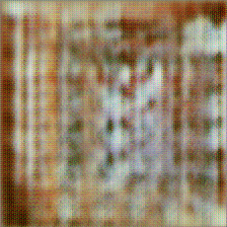
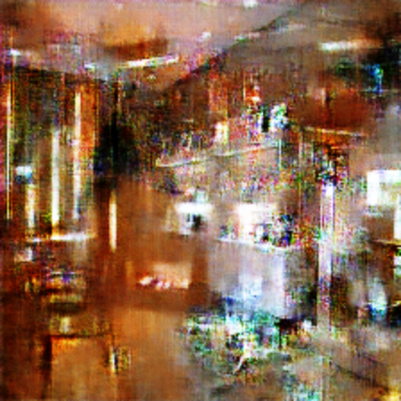
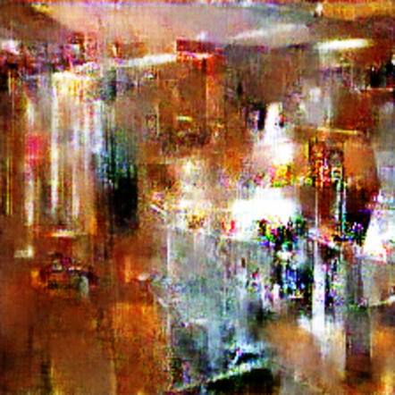

# Summary
Producing indoor scene images using Generative Adversarial Networks (GANs).

This model has intended to expand a currently available dataset of indoor scene images. 

## OS and Hardware 
- **OS:** Ubuntu 19.04
- **Processor:** Intel Core i7-4770 CPU @ 3.40GHz × 8
- **Graphics:** GeForce GTX 1080 Ti/PCIe/SSE2
- **Memory:** Kingston HyperX Fury Red 16 GB (2 x 8 GB)

## Notes
- For most of the cases, training last till 50.000 epoch. The only reason is the time needed in order to reach results. If there is enough time, future models will be trained on more epochs. By that, generator models will produce better results. 
- Some examples don't have Accuracy metrics. The reason is later development and optimizations of these metrics for adequate usage. If there is enough time, they will be added in the future.
- Training with a greater amount of samples from the dataset isn't possible with current hardware. The source code could be optimized, but it will still take too much time to train the model on all training samples until it converge.

# Cases
## Single class with single image
In this case, the training process involves just a single image from a single class. While having a single sample from the whole dataset has great performance (in training time needed to converge in order to get optimal results), it tends to over-fit the generator model. From the perspective of the generator model, this means that it will produce the same image no matter the given input to the mode (this image will be almost the same as the image from training process).

This model is trained on **10.000** epoch. Training last **1h 45m 09s**.

Bellow is the original image used for training of the models as well as generator image samples throughout the epochs.

Examples show that the generator model over-fit during the training process, but nevertheless, it also tries to generate a distinct image having other two image samples as a reference.

### An Original image
<center>
<table>
    <tr>
        <td>Original Image</td>
    </tr>
    <tr>
        <td></td>
    </tr>
</table>
</center>

### Examples through epochs
<center>
<table>
    <tr>
        <td>Epoch 10</td>
        <td>Epoch 300</td>
        <td>Epoch 500</td>
    </tr>
    <tr>
        <td></td>
        <td></td>
        <td></td>
    </tr>
    <tr>
        <td>Epoch 700</td>
        <td>Epoch 900</td>
        <td>Epoch 1500</td>
    </tr>
    <tr>
        <td></td>
        <td></td>
        <td></td>
    </tr>
    <tr>
        <td>Epoch 3.000</td>
        <td>Epoch 5.000</td>
        <td>Epoch 10.000</td>
    </tr>
    <tr>
        <td></td>
        <td></td>
        <td></td>
    </tr>
</table>
</center>

### Model loss
<center>
<table>
    <tr>
        <td>Generator Loss</td>
    </tr>
    <tr>
        <td></td>
    </tr>
    <tr>
		<td>Discriminator Loss</td>
    </tr>
    <tr>
		<td></td>
    </tr>
</table>
</center>

## Single class with three images
In this case, the training process involves three images from a single class. Same as in the previous case, this model tends to over-fit. But there is a difference. Because of the randomness of the input seed matrix and more than one image samples during the training process, this model tries to pick an indoor scene pattern and construct a new unique image. 

Bellow are three original images used for training of the models as well as generator image samples throughout the epochs.

This model is trained on **50.000** epoch. Training last **7h 29m 11s**.

### An Original images
<center>
<table>
    <tr>
        <td></td>
        <td></td>
        <td></td>
    </tr>
</table>
</center>

### Examples through epochs
<center>
<table>
    <tr>
        <td>Epoch 10</td>
        <td>Epoch 300</td>
        <td>Epoch 500</td>
    </tr>
    <tr>
        <td></td>
        <td></td>
        <td></td>
    </tr>
    <tr>
        <td>Epoch 700</td>
        <td>Epoch 900</td>
        <td>Epoch 2000</td>
    </tr>
    <tr>
        <td></td>
        <td></td>
        <td></td>
    </tr>
    <tr>
        <td>Epoch 5.000</td>
        <td>Epoch 10.000</td>
        <td>Epoch 15.000</td>
    </tr>
    <tr>
        <td></td>
        <td></td>
        <td></td>
    </tr>
    <tr>
        <td>Epoch 21.000</td>
        <td>Epoch 26.000</td>
        <td>Epoch 40.000</td>
    </tr>
    <tr>
        <td></td>
        <td></td>
        <td></td>
    </tr>
    <tr>
        <td>Epoch 46.000</td>
        <td>Epoch 48.000</td>
        <td>Epoch 50.000</td>
    </tr>
    <tr>
        <td></td>
        <td></td>
        <td></td>
    </tr>
</table>
</center>

### Model loss
<center>
<table>
    <tr>
        <td>Generator Loss</td>
        <td>Discriminator Loss</td>
    </tr>
    <tr>
        <td></td>
        <td></td>
    </tr>
</table>
</center>

## Single class with ten images
Explanation ...

```bash
Number of epochs: 50.000
Training duration: 11h 1m 16s
```

### An Original images
Could be seen at "assets/images/single_class_ten_images/image_list.txt".

### Examples through epochs
<center>
<table>
    <tr>
        <td>Epoch 10</td>
        <td>Epoch 300</td>
        <td>Epoch 500</td>
    </tr>
    <tr>
        <td></td>
        <td></td>
        <td></td>
    </tr>
    <tr>
        <td>Epoch 700</td>
        <td>Epoch 900</td>
        <td>Epoch 2000</td>
    </tr>
    <tr>
        <td></td>
        <td></td>
        <td></td>
    </tr>
    <tr>
        <td>Epoch 5.000</td>
        <td>Epoch 10.000</td>
        <td>Epoch 15.000</td>
    </tr>
    <tr>
        <td></td>
        <td></td>
        <td></td>
    </tr>
    <tr>
        <td>Epoch 21.000</td>
        <td>Epoch 26.000</td>
        <td>Epoch 40.000</td>
    </tr>
    <tr>
        <td></td>
        <td></td>
        <td></td>
    </tr>
    <tr>
        <td>Epoch 46.000</td>
        <td>Epoch 48.000</td>
        <td>Epoch 50.000</td>
    </tr>
    <tr>
        <td></td>
        <td></td>
        <td></td>
    </tr>
</table>
</center>

### Model loss
<center>
<table>
    <tr>
        <td>Generator Loss</td>
        <td>Discriminator Loss</td>
    </tr>
    <tr>
        <td></td>
        <td></td>
    </tr>
</table>
</center>

## Single class with hundred images
Explanation ...

```bash
Number of epochs: 50.000
Training duration: 16h 41m 44s
```

### An Original images
Could be seen at "assets/images/single_class_hundred_images/image_list.txt".

### Examples through epochs
<center>
<table>
    <tr>
        <td>Epoch 10</td>
        <td>Epoch 300</td>
        <td>Epoch 500</td>
    </tr>
    <tr>
        <td></td>
        <td></td>
        <td></td>
    </tr>
    <tr>
        <td>Epoch 700</td>
        <td>Epoch 900</td>
        <td>Epoch 2000</td>
    </tr>
    <tr>
        <td></td>
        <td></td>
        <td></td>
    </tr>
    <tr>
        <td>Epoch 5.000</td>
        <td>Epoch 10.000</td>
        <td>Epoch 15.000</td>
    </tr>
    <tr>
        <td></td>
        <td></td>
        <td></td>
    </tr>
    <tr>
        <td>Epoch 21.000</td>
        <td>Epoch 26.000</td>
        <td>Epoch 40.000</td>
    </tr>
    <tr>
        <td></td>
        <td></td>
        <td></td>
    </tr>
    <tr>
        <td>Epoch 46.000</td>
        <td>Epoch 48.000</td>
        <td>Epoch 50.000</td>
    </tr>
    <tr>
        <td></td>
        <td></td>
        <td></td>
    </tr>
</table>
</center>

### Model loss
<center>
<table>
    <tr>
        <td>Generator Loss</td>
        <td>Discriminator Loss</td>
    </tr>
    <tr>
        <td></td>
        <td></td>
    </tr>
</table>
</center>

## Single class with all images
Explanation ...

```bash
Number of epochs: 50.000
Training duration: 17h 17m 50s
```

### An Original images
Could be seen at "assets/images/single_class_all_images/image_list.txt".

### Examples through epochs
<center>
<table>
    <tr>
        <td>Epoch 10</td>
        <td>Epoch 300</td>
        <td>Epoch 500</td>
    </tr>
    <tr>
        <td></td>
        <td></td>
        <td></td>
    </tr>
    <tr>
        <td>Epoch 700</td>
        <td>Epoch 900</td>
        <td>Epoch 2000</td>
    </tr>
    <tr>
        <td></td>
        <td></td>
        <td></td>
    </tr>
    <tr>
        <td>Epoch 5.000</td>
        <td>Epoch 10.000</td>
        <td>Epoch 15.000</td>
    </tr>
    <tr>
        <td></td>
        <td></td>
        <td></td>
    </tr>
    <tr>
        <td>Epoch 21.000</td>
        <td>Epoch 26.000</td>
        <td>Epoch 40.000</td>
    </tr>
    <tr>
        <td></td>
        <td></td>
        <td></td>
    </tr>
    <tr>
        <td>Epoch 46.000</td>
        <td>Epoch 48.000</td>
        <td>Epoch 50.000</td>
    </tr>
    <tr>
        <td></td>
        <td></td>
        <td></td>
    </tr>
</table>
</center>

### Loss
<center>
<table>
    <tr>
        <td>Generator Loss</td>
        <td>Discriminator Loss</td>
    </tr>
    <tr>
        <td></td>
        <td></td>
    </tr>
</table>
</center>

### Accuracy
<center>
<table>
    <tr>
        <td>Discriminator on real images</td>
    </tr>
    <tr>
        <td></td>
    </tr>
    <tr>
        <td>Discriminator on fake images</td>
    </tr>
    <tr>
        <td></td>
    </tr>
    <tr>
        <td>Discriminator combined mean loss</td>
    </tr>
    <tr>
        <td></td>
    </tr>
</table>
</center>

## All class with ten images
Explanation ...

```bash
Number of epochs: 50.000
Training duration: 17h 17m 50s
```

### An Original images
Could be seen at "assets/images/all_classes_ten_images/image_list.txt".

### Examples through epochs
<center>
<table>
    <tr>
        <td>Epoch 10</td>
        <td>Epoch 300</td>
        <td>Epoch 500</td>
    </tr>
    <tr>
        <td></td>
        <td></td>
        <td></td>
    </tr>
    <tr>
        <td>Epoch 700</td>
        <td>Epoch 900</td>
        <td>Epoch 2000</td>
    </tr>
    <tr>
        <td></td>
        <td></td>
        <td></td>
    </tr>
    <tr>
        <td>Epoch 5.000</td>
        <td>Epoch 10.000</td>
        <td>Epoch 15.000</td>
    </tr>
    <tr>
        <td></td>
        <td></td>
        <td></td>
    </tr>
    <tr>
        <td>Epoch 21.000</td>
        <td>Epoch 26.000</td>
        <td>Epoch 40.000</td>
    </tr>
    <tr>
        <td></td>
        <td></td>
        <td></td>
    </tr>
    <tr>
        <td>Epoch 46.000</td>
        <td>Epoch 48.000</td>
        <td>Epoch 50.000</td>
    </tr>
    <tr>
        <td></td>
        <td></td>
        <td></td>
    </tr>
</table>
</center>

### Loss
<center>
<table>
    <tr>
        <td>Generator Loss</td>
        <td>Discriminator Loss</td>
    </tr>
    <tr>
        <td></td>
        <td></td>
    </tr>
</table>
</center>

### Accuracy
<center>
<table>
    <tr>
        <td>Discriminator on real images</td>
    </tr>
    <tr>
        <td></td>
    </tr>
    <tr>
        <td>Discriminator on fake images</td>
    </tr>
    <tr>
        <td></td>
    </tr>
    <tr>
        <td>Discriminator combined mean loss</td>
    </tr>
    <tr>
        <td></td>
    </tr>
</table>
</center>
