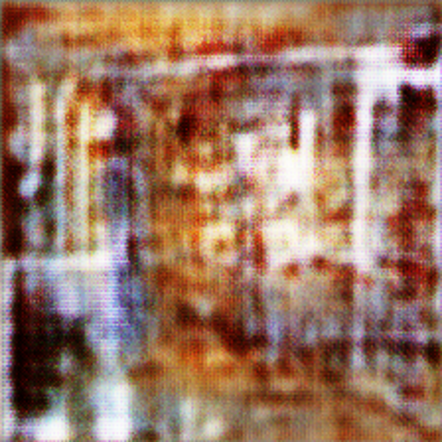
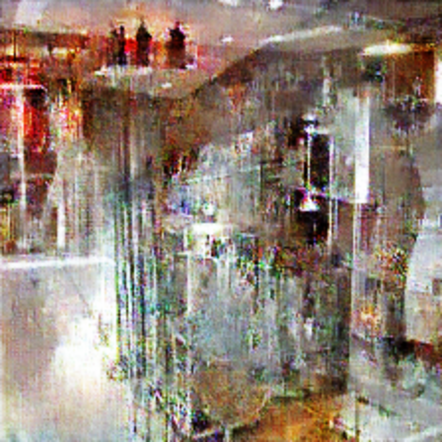
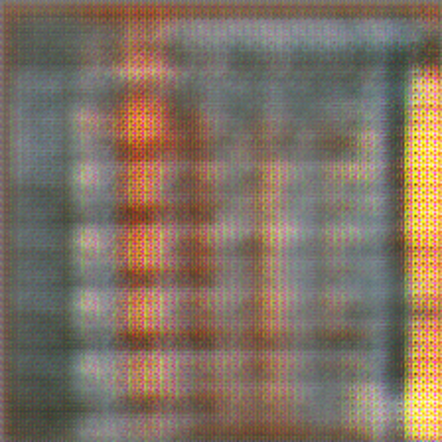
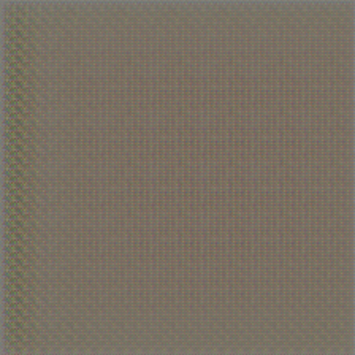
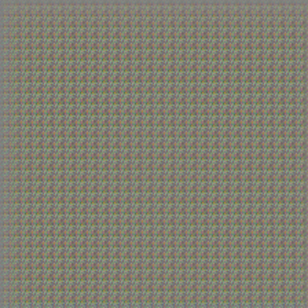

# Summary
Apply Generative Adversarial Network (GAN) to generate indoor scene images. 

This model could be used to generate new indoor scene images and by that extend an available dataset of indoor scenes. Newly generated images should improve accuracy of indoor scene classifier model.

## OS and Hardware
- **OS:** Ubuntu 19.04
- **Processor:** Intel® Core™ i7-4770 CPU @ 3.40GHz × 8
- **Graphics:** GeForce GTX 1080 Ti/PCIe/SSE2
- **Memory:** 16GB

## Notes
- Some examples don't have Accuracy metrics. The reason is later development and optimizations of these metrics for proper usage. If there is enough time, it will be added in the future.
- For larger data examples, more resources (or better optimizations) are needed. This is planned will be applied in future development or future projects.

# Cases
## Single class with single image
Training process of the Generator model is apply to the single class containing single image generator results converge to recognizable images really fast. This results in high over-fit. In case of Generator model, for any input noise tensor, output will be the same image used in the training process.

```bash
Number of epochs: 10.000
Training duration: 1h 45m 9s
```

### An Original image
<center>
<table>
    <tr>
        <td>Original Image</td>
    </tr>
    <tr>
        <td></td>
    </tr>
</table>
</center>

### Examples through epochs
<center>
<table>
    <tr>
        <td>Epoch 10</td>
        <td>Epoch 300</td>
        <td>Epoch 500</td>
    </tr>
    <tr>
        <td></td>
        <td></td>
        <td></td>
    </tr>
    <tr>
        <td>Epoch 700</td>
        <td>Epoch 900</td>
        <td>Epoch 1500</td>
    </tr>
    <tr>
        <td></td>
        <td></td>
        <td></td>
    </tr>
    <tr>
        <td>Epoch 3.000</td>
        <td>Epoch 5.000</td>
        <td>Epoch 10.000</td>
    </tr>
    <tr>
        <td></td>
        <td></td>
        <td></td>
    </tr>
</table>
</center>

### Model loss
<center>
<table>
    <tr>
        <td>Generator Loss</td>
        <td>Discriminator Loss</td>
    </tr>
    <tr>
        <td></td>
        <td></td>
    </tr>
</table>
</center>

## Single class with three images
Explanation ...

```bash
Number of epochs: 50.000
Training duration: 7h 29m 11s
```

### An Original images
<center>
<table>
    <tr>
        <td></td>
        <td></td>
        <td></td>
    </tr>
</table>
</center>

### Examples through epochs
<center>
<table>
    <tr>
        <td>Epoch 10</td>
        <td>Epoch 300</td>
        <td>Epoch 500</td>
    </tr>
    <tr>
        <td></td>
        <td></td>
        <td></td>
    </tr>
    <tr>
        <td>Epoch 700</td>
        <td>Epoch 900</td>
        <td>Epoch 2000</td>
    </tr>
    <tr>
        <td></td>
        <td></td>
        <td></td>
    </tr>
    <tr>
        <td>Epoch 5.000</td>
        <td>Epoch 10.000</td>
        <td>Epoch 15.000</td>
    </tr>
    <tr>
        <td></td>
        <td></td>
        <td></td>
    </tr>
    <tr>
        <td>Epoch 21.000</td>
        <td>Epoch 26.000</td>
        <td>Epoch 40.000</td>
    </tr>
    <tr>
        <td></td>
        <td></td>
        <td></td>
    </tr>
    <tr>
        <td>Epoch 46.000</td>
        <td>Epoch 48.000</td>
        <td>Epoch 50.000</td>
    </tr>
    <tr>
        <td></td>
        <td></td>
        <td></td>
    </tr>
</table>
</center>

### Model loss
<center>
<table>
    <tr>
        <td>Generator Loss</td>
        <td>Discriminator Loss</td>
    </tr>
    <tr>
        <td></td>
        <td></td>
    </tr>
</table>
</center>

## Single class with ten images
Explanation ...

```bash
Number of epochs: 50.000
Training duration: 11h 1m 16s
```

### An Original images
Could be seen at "assets/images/single_class_ten_images/image_list.txt".

### Examples through epochs
<center>
<table>
    <tr>
        <td>Epoch 10</td>
        <td>Epoch 300</td>
        <td>Epoch 500</td>
    </tr>
    <tr>
        <td></td>
        <td></td>
        <td></td>
    </tr>
    <tr>
        <td>Epoch 700</td>
        <td>Epoch 900</td>
        <td>Epoch 2000</td>
    </tr>
    <tr>
        <td></td>
        <td></td>
        <td></td>
    </tr>
    <tr>
        <td>Epoch 5.000</td>
        <td>Epoch 10.000</td>
        <td>Epoch 15.000</td>
    </tr>
    <tr>
        <td></td>
        <td></td>
        <td></td>
    </tr>
    <tr>
        <td>Epoch 21.000</td>
        <td>Epoch 26.000</td>
        <td>Epoch 40.000</td>
    </tr>
    <tr>
        <td></td>
        <td></td>
        <td></td>
    </tr>
    <tr>
        <td>Epoch 46.000</td>
        <td>Epoch 48.000</td>
        <td>Epoch 50.000</td>
    </tr>
    <tr>
        <td></td>
        <td></td>
        <td></td>
    </tr>
</table>
</center>

### Model loss
<center>
<table>
    <tr>
        <td>Generator Loss</td>
        <td>Discriminator Loss</td>
    </tr>
    <tr>
        <td></td>
        <td></td>
    </tr>
</table>
</center>

## Single class with hundred images
Explanation ...

```bash
Number of epochs: 50.000
Training duration: 16h 41m 44s
```

### An Original images
Could be seen at "assets/images/single_class_hundred_images/image_list.txt".

### Examples through epochs
<center>
<table>
    <tr>
        <td>Epoch 10</td>
        <td>Epoch 300</td>
        <td>Epoch 500</td>
    </tr>
    <tr>
        <td></td>
        <td></td>
        <td></td>
    </tr>
    <tr>
        <td>Epoch 700</td>
        <td>Epoch 900</td>
        <td>Epoch 2000</td>
    </tr>
    <tr>
        <td></td>
        <td></td>
        <td></td>
    </tr>
    <tr>
        <td>Epoch 5.000</td>
        <td>Epoch 10.000</td>
        <td>Epoch 15.000</td>
    </tr>
    <tr>
        <td></td>
        <td></td>
        <td></td>
    </tr>
    <tr>
        <td>Epoch 21.000</td>
        <td>Epoch 26.000</td>
        <td>Epoch 40.000</td>
    </tr>
    <tr>
        <td></td>
        <td></td>
        <td></td>
    </tr>
    <tr>
        <td>Epoch 46.000</td>
        <td>Epoch 48.000</td>
        <td>Epoch 50.000</td>
    </tr>
    <tr>
        <td></td>
        <td></td>
        <td></td>
    </tr>
</table>
</center>

### Model loss
<center>
<table>
    <tr>
        <td>Generator Loss</td>
        <td>Discriminator Loss</td>
    </tr>
    <tr>
        <td></td>
        <td></td>
    </tr>
</table>
</center>

## Single class with all images
Explanation ...

```bash
Number of epochs: 50.000
Training duration: 17h 17m 50s
```

### An Original images
Could be seen at "assets/images/single_class_all_images/image_list.txt".

### Examples through epochs
<center>
<table>
    <tr>
        <td>Epoch 10</td>
        <td>Epoch 300</td>
        <td>Epoch 500</td>
    </tr>
    <tr>
        <td></td>
        <td></td>
        <td></td>
    </tr>
    <tr>
        <td>Epoch 700</td>
        <td>Epoch 900</td>
        <td>Epoch 2000</td>
    </tr>
    <tr>
        <td></td>
        <td></td>
        <td></td>
    </tr>
    <tr>
        <td>Epoch 5.000</td>
        <td>Epoch 10.000</td>
        <td>Epoch 15.000</td>
    </tr>
    <tr>
        <td></td>
        <td></td>
        <td></td>
    </tr>
    <tr>
        <td>Epoch 21.000</td>
        <td>Epoch 26.000</td>
        <td>Epoch 40.000</td>
    </tr>
    <tr>
        <td></td>
        <td></td>
        <td></td>
    </tr>
    <tr>
        <td>Epoch 46.000</td>
        <td>Epoch 48.000</td>
        <td>Epoch 50.000</td>
    </tr>
    <tr>
        <td></td>
        <td></td>
        <td></td>
    </tr>
</table>
</center>

### Loss
<center>
<table>
    <tr>
        <td>Generator Loss</td>
        <td>Discriminator Loss</td>
    </tr>
    <tr>
        <td></td>
        <td></td>
    </tr>
</table>
</center>

### Accuracy
<center>
<table>
    <tr>
        <td>Discriminator on real images</td>
    </tr>
    <tr>
        <td></td>
    </tr>
    <tr>
        <td>Discriminator on fake images</td>
    </tr>
    <tr>
        <td></td>
    </tr>
    <tr>
        <td>Discriminator combined mean loss</td>
    </tr>
    <tr>
        <td></td>
    </tr>
</table>
</center>

### Notes
- [Cool list of available datasets](https://github.com/awesomedata/awesome-public-datasets)