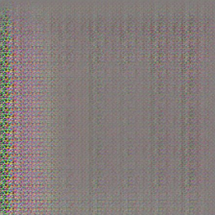
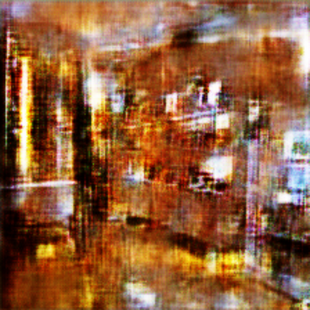
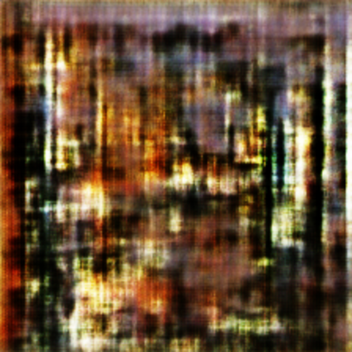
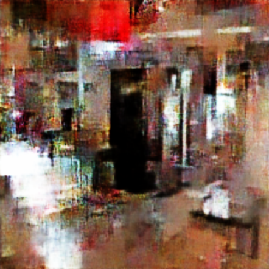
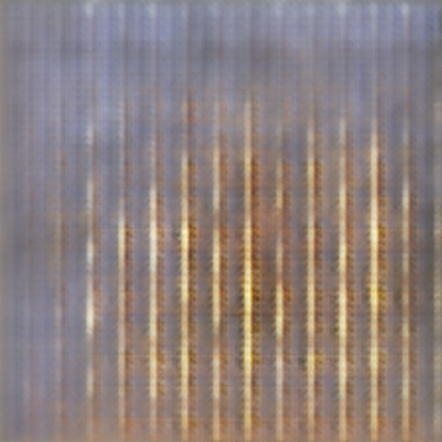

# Summary
Producing indoor scene images using Generative Adversarial Networks (GANs).

This model has intended to expand a currently available dataset of indoor scene images. Because of hardware and time limitations, this is not fully achieved. However, in the moment of overcoming these constraints, the same code could be used in order to get better outcomes.

Bellow are specified OS and Hardware elements used during this project R&D, explanation of the used dataset and additional notes to answer FAQ. Besides this, most of the documentation consists of cases in which models were trained. Those cases consist of conclusions, image lists used during training, generator samples on arbitrarily chosen epochs, and models loss and accuracy during epochs. These cases are intended to give more intuition on how GANs tries to solve the given problem.

## OS and Hardware 
- **OS:** Ubuntu 19.04
- **Processor:** Intel Core i7-4770 CPU @ 3.40GHz × 8
- **Graphics:** GeForce GTX 1080 Ti/PCIe/SSE2
- **Memory:** Kingston HyperX Fury Red 16 GB (2 x 8 GB)

## Notes
- For most of the cases, training last till 50.000 epoch. The only reason is the time needed in order to reach results. If there is enough time, future models will be trained on more epochs. By that, generator models will produce better results. 
- Some examples don't have Accuracy metrics. The reason is later development and optimizations of these metrics for adequate usage. If there is enough time, they will be added in the future.
- Training with a greater amount of samples from the dataset isn't possible with current hardware. The source code could be optimized, but it will still take too much time to train the model on all training samples until it converge.

## Dataset
The [dataset](http://groups.csail.mit.edu/vision/LabelMe/NewImages/indoorCVPR_09.tar) contains 67 Indoor categories, and a total of 15620 images. The number of images varies across categories, but there are at least 100 images per category. All images are in jpg format. The images provided here are for research purposes only.

# Cases
## Single class with single image
In this case, the training process involves just a single image from a single class. While having a single sample from the whole dataset has great performance (in training time needed to converge in order to get optimal results), it tends to over-fit the generator model. From the perspective of the generator model, this means that it will produce the same image no matter the given input to the mode (this image will be almost the same as the image from training process).

This model is trained on **10.000** epoch. Training last **1h 45m 09s**.

Bellow is the original image used for training of the models as well as generator image samples throughout the epochs.

Examples show that the generator model over-fit fast and continued to do it throughout the epochs.

### An Original image
<table>
    <tr>
        <td>Original Image</td>
    </tr>
    <tr>
        <td></td>
    </tr>
</table>

### Examples through epochs
<table>
    <tr>
        <td>Epoch 10</td>
        <td>Epoch 300</td>
        <td>Epoch 500</td>
    </tr>
    <tr>
        <td></td>
        <td></td>
        <td></td>
    </tr>
    <tr>
        <td>Epoch 700</td>
        <td>Epoch 900</td>
        <td>Epoch 1500</td>
    </tr>
    <tr>
        <td></td>
        <td></td>
        <td></td>
    </tr>
    <tr>
        <td>Epoch 3.000</td>
        <td>Epoch 5.000</td>
        <td>Epoch 10.000</td>
    </tr>
    <tr>
        <td></td>
        <td></td>
        <td></td>
    </tr>
</table>

### Loss
<table>
    <tr>
        <td>Generator Loss</td>
    </tr>
    <tr>
        <td></td>
    </tr>
    <tr>
		<td>Discriminator Loss</td>
    </tr>
    <tr>
		<td></td>
    </tr>
</table>

## Single class with three images
In this case, the training process involves three images from a single class. Same as in the previous case, this model tends to over-fit. But there is a difference. Because of the randomness of the input seed matrix and more than one image samples during the training process, this model tries to pick an indoor scene pattern and construct a new unique image. 

Bellow are three original images used for training of the models as well as generator image samples throughout the epochs.

This model is trained on **50.000** epoch. Training last **7h 29m 11s**.

Examples show that the generator model over-fit during the training process, but nevertheless, it also tries to generate a distinct image having other two image samples as a reference.

### An Original images
<table>
    <tr>
        <td></td>
        <td></td>
        <td></td>
    </tr>
</table>

### Examples through epochs
<table>
    <tr>
        <td>Epoch 10</td>
        <td>Epoch 300</td>
        <td>Epoch 500</td>
    </tr>
    <tr>
        <td></td>
        <td></td>
        <td></td>
    </tr>
    <tr>
        <td>Epoch 700</td>
        <td>Epoch 900</td>
        <td>Epoch 2000</td>
    </tr>
    <tr>
        <td></td>
        <td></td>
        <td></td>
    </tr>
    <tr>
        <td>Epoch 5.000</td>
        <td>Epoch 10.000</td>
        <td>Epoch 15.000</td>
    </tr>
    <tr>
        <td></td>
        <td></td>
        <td></td>
    </tr>
    <tr>
        <td>Epoch 21.000</td>
        <td>Epoch 26.000</td>
        <td>Epoch 40.000</td>
    </tr>
    <tr>
        <td></td>
        <td></td>
        <td></td>
    </tr>
    <tr>
        <td>Epoch 46.000</td>
        <td>Epoch 48.000</td>
        <td>Epoch 50.000</td>
    </tr>
    <tr>
        <td></td>
        <td></td>
        <td></td>
    </tr>
</table>

### Loss
<table>
    <tr>
        <td>Generator Loss</td>
    </tr>
    <tr>
        <td></td>
    </tr>
    <tr>
    	<td>Discriminator Loss</td>
    </tr>
    <tr>
        <td></td>
    </tr>
</table>

## Single class with ten images
Training models on the single class with ten images. In this, and rest of the bellow cases when more images are introduced, models aren't likely to over-fit, but, they struggle to find a pattern between given image samples. 

The explanation is simple, it's very hard for the generator model to find a way to produce real looking images by comparing many image samples. In order to accomplish this, the generator must find a pattern between indoor scene images and how to interpolate them to look real. This is especially hard for a given dataset because it contains a large number of details for each image sample, that is unique to it.

As a result, models trained on a larger number of images tend to generate more abstract artistic images than real looking ones.

This model is trained on **50.000** epoch. Training last **11h 1m 16s**.

### An Original images
Could be fount at:   
> assets/images/single_class_ten_images/image_list.txt

### Examples through epochs
<table>
    <tr>
        <td>Epoch 10</td>
        <td>Epoch 300</td>
        <td>Epoch 500</td>
    </tr>
    <tr>
        <td></td>
        <td></td>
        <td></td>
    </tr>
    <tr>
        <td>Epoch 700</td>
        <td>Epoch 900</td>
        <td>Epoch 2000</td>
    </tr>
    <tr>
        <td></td>
        <td></td>
        <td></td>
    </tr>
    <tr>
        <td>Epoch 5.000</td>
        <td>Epoch 10.000</td>
        <td>Epoch 15.000</td>
    </tr>
    <tr>
        <td></td>
        <td></td>
        <td></td>
    </tr>
    <tr>
        <td>Epoch 21.000</td>
        <td>Epoch 26.000</td>
        <td>Epoch 40.000</td>
    </tr>
    <tr>
        <td></td>
        <td></td>
        <td></td>
    </tr>
    <tr>
        <td>Epoch 46.000</td>
        <td>Epoch 48.000</td>
        <td>Epoch 50.000</td>
    </tr>
    <tr>
        <td></td>
        <td></td>
        <td></td>
    </tr>
</table>

### Loss
<table>
    <tr>
        <td>Generator Loss</td>
    </tr>
    <tr>
        <td></td>
    </tr>
    <tr>
    	<td>Discriminator Loss</td>
    </tr>
    <tr>
        <td></td>
    </tr>
</table>

## Single class with a hundred images
Training models on the single class with a hundred images.

This model is trained on **50.000** epoch. Training last **16h 41m 44s**.

### An Original images
Could be fount at:   
> assets/images/single_class_hundred_images/image_list.txt

### Examples through epochs
<table>
    <tr>
        <td>Epoch 10</td>
        <td>Epoch 300</td>
        <td>Epoch 500</td>
    </tr>
    <tr>
        <td></td>
        <td></td>
        <td></td>
    </tr>
    <tr>
        <td>Epoch 700</td>
        <td>Epoch 900</td>
        <td>Epoch 2000</td>
    </tr>
    <tr>
        <td></td>
        <td></td>
        <td></td>
    </tr>
    <tr>
        <td>Epoch 5.000</td>
        <td>Epoch 10.000</td>
        <td>Epoch 15.000</td>
    </tr>
    <tr>
        <td></td>
        <td></td>
        <td></td>
    </tr>
    <tr>
        <td>Epoch 21.000</td>
        <td>Epoch 26.000</td>
        <td>Epoch 40.000</td>
    </tr>
    <tr>
        <td></td>
        <td></td>
        <td></td>
    </tr>
    <tr>
        <td>Epoch 46.000</td>
        <td>Epoch 48.000</td>
        <td>Epoch 50.000</td>
    </tr>
    <tr>
        <td></td>
        <td></td>
        <td></td>
    </tr>
</table>

### Loss
<table>
    <tr>
        <td>Generator Loss</td>
    </tr>
    <tr>
        <td></td>
    </tr>
    <tr>
    	<td>Discriminator Loss</td>
    </tr>
    <tr>
        <td></td>
    </tr>
</table>

## Single class with all images
Training models on the single class with all (157) images.

This model is trained on **50.000** epoch. Training last **17h 17m 50s**.

### An Original images
Could be fount at:   
> assets/images/single_class_all_images/image_list.txt

### Examples through epochs
<table>
    <tr>
        <td>Epoch 10</td>
        <td>Epoch 300</td>
        <td>Epoch 500</td>
    </tr>
    <tr>
        <td></td>
        <td></td>
        <td></td>
    </tr>
    <tr>
        <td>Epoch 700</td>
        <td>Epoch 900</td>
        <td>Epoch 2000</td>
    </tr>
    <tr>
        <td></td>
        <td></td>
        <td></td>
    </tr>
    <tr>
        <td>Epoch 5.000</td>
        <td>Epoch 10.000</td>
        <td>Epoch 15.000</td>
    </tr>
    <tr>
        <td></td>
        <td></td>
        <td></td>
    </tr>
    <tr>
        <td>Epoch 21.000</td>
        <td>Epoch 26.000</td>
        <td>Epoch 40.000</td>
    </tr>
    <tr>
        <td></td>
        <td></td>
        <td></td>
    </tr>
    <tr>
        <td>Epoch 46.000</td>
        <td>Epoch 48.000</td>
        <td>Epoch 50.000</td>
    </tr>
    <tr>
        <td></td>
        <td></td>
        <td></td>
    </tr>
</table>

### Loss
<table>
    <tr>
        <td>Generator Loss</td>
    </tr>
    <tr>
        <td></td>
    </tr>
    <tr>
    	<td>Discriminator Loss</td>
    </tr>
    <tr>
        <td></td>
    </tr>
</table>

### Accuracy
<table>
    <tr>
        <td>Discriminator on real images</td>
    </tr>
    <tr>
        <td></td>
    </tr>
    <tr>
        <td>Discriminator on fake images</td>
    </tr>
    <tr>
        <td></td>
    </tr>
    <tr>
        <td>Discriminator combined mean loss</td>
    </tr>
    <tr>
        <td></td>
    </tr>
</table>

## All class with ten images
Training models on the all classes with ten images.

This model is trained on **50.000** epoch. Training last **50h 26m 01s**.

### An Original images
Could be fount at:   
> assets/images/all_classes_ten_images/image_list.txt

### Examples through epochs
<table>
    <tr>
        <td>Epoch 10</td>
        <td>Epoch 300</td>
        <td>Epoch 500</td>
    </tr>
    <tr>
        <td></td>
        <td></td>
        <td></td>
    </tr>
    <tr>
        <td>Epoch 700</td>
        <td>Epoch 900</td>
        <td>Epoch 2000</td>
    </tr>
    <tr>
        <td></td>
        <td></td>
        <td></td>
    </tr>
    <tr>
        <td>Epoch 5.000</td>
        <td>Epoch 10.000</td>
        <td>Epoch 15.000</td>
    </tr>
    <tr>
        <td></td>
        <td></td>
        <td></td>
    </tr>
    <tr>
        <td>Epoch 21.000</td>
        <td>Epoch 26.000</td>
        <td>Epoch 40.000</td>
    </tr>
    <tr>
        <td></td>
        <td></td>
        <td></td>
    </tr>
    <tr>
        <td>Epoch 46.000</td>
        <td>Epoch 48.000</td>
        <td>Epoch 50.000</td>
    </tr>
    <tr>
        <td></td>
        <td></td>
        <td></td>
    </tr>
</table>

### Loss
<table>
    <tr>
        <td>Generator Loss</td>
    </tr>
    <tr>
        <td></td>
    </tr>
    <tr>
    	<td>Discriminator Loss</td>
    </tr>
    <tr>
        <td></td>
    </tr>
</table>

### Accuracy
<table>
    <tr>
        <td>Discriminator on real images</td>
    </tr>
    <tr>
        <td></td>
    </tr>
    <tr>
        <td>Discriminator on fake images</td>
    </tr>
    <tr>
        <td></td>
    </tr>
    <tr>
        <td>Discriminator combined mean loss</td>
    </tr>
    <tr>
        <td></td>
    </tr>
</table>
